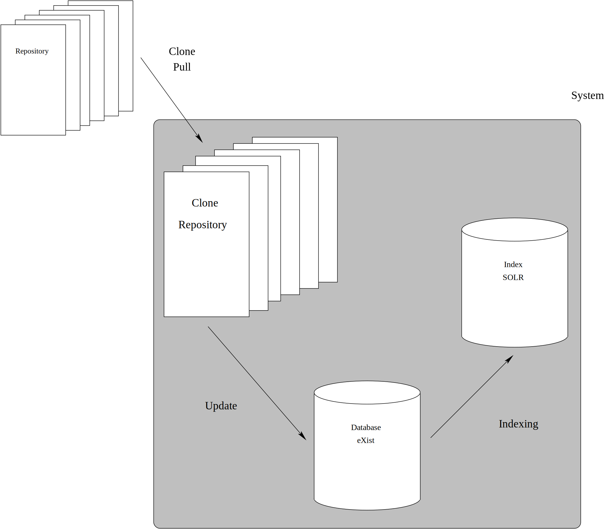

[README](README.md) | [Architecture](ARCHITECTURE.md) | [Installation](INSTALL.md) | [Collections](./collections/README.md)

# Tools for the mirroring of repositories 

1. The term **repository** is used as a synonym for a data or software project stored in a revision control system. To begin with we limit ourselves to GIT.
2. The term **user** is referring to a library patron registrered in our user database. The **user**(s) is(are) the editor(s) responsible for the **repository**
3. The term **system** is referring to the repository-mirror system
4. A **release** is a named version (a tag) which can be manipulated using git tag commands and in particular be retrieved in a predictable condition. A branch is dynamic and change until frozen and merged with its master branch.
5. Here we refer to **commit** is including all revisions up to and including the identified commit in the given branch.

## Workflow

### 1. An external repository is registered in the database

A user at a remote git repository is given read access to that
repository. We do not need this, unless the repository is private

### 2. The user selects a destination

Depending on the destination status the user needs to enter slightly different data

1. **staging** - The user may choose the HEAD or any commit in any branch

2. **production** - The user chooses a named release for publication

The two statuses store data in separate databases and only the latter
is public. The staging service is a test site for the editorial users.

### 3. The user selects branch and induces pull operations

Running asynchronously using [ActiveMQ](#4-activemq) Multiple jobs per
repository should not be permitted. The system should ensure this is
impossible.

### 4. Upon successful pull (3 above), the system queues loading and indexing of data

1. Mirrors the data in local git repository
2. Store them in database (eXist)
3. Request indexing service for index documents
4. Store the index documents in index (Solr)

#### Process

We have different branches, either locally or remotely or both. Two
are the ones we work with. One is in our remote git text repository
and one in the remote repository. Their names are in the String
variables

* publishedBranch

and 

* branch

respectively.

The former is in the configuration file the latter comes in a message
from ActiveMQ. __publishedBranch__ is where we do the work. There isn't any
corresponding branch remotely so there is no need to pull. This branch
should reflect the status of the last

First we establish which files differ between the two. Then we merge
the remote desired branch with publishedBranch
			
By doing this in this odd order, we'll be able to take into account
the fact that the database might contain earlier changes. These will
be overwritten below when we queue up the operations in the op HashMap
for execution in the next step in the "conveyor belt" 

([See RunPull.java, line 57 and forward](/repository-mirror/blob/master/repository-pull/src/main/java/dk/kb/pullStuff/RunPull.java#L57))

Most of this software is already written and available in [Solr and
Snippets](https://github.com/Det-Kongelige-Bibliotek/solr-and-snippets)

Some kind of pipeline implemented using [ActiveMQ](#4-activemq)

### 5. If failure in 3-4 above, messages should be passed to those who can do something about it

Task should be stored somewhere for re-execution

### 6. Upon successful loading in 4. above, the data become directly available in the environment selected in 2 above.

### 7. If failure, go to 4.

## Ideas

### 1. Git Large File Storage (LFS)

"Git Large File Storage (LFS) replaces large files such as audio
samples, videos, datasets, and graphics with text pointers inside Git,
while storing the file contents on a remote server like GitHub.com or
GitHub Enterprise" Sounds promising :^)

https://git-lfs.github.com/

Imagine correlated correlated or transcribed text and images, videos or sounds. A
system-dependent way of maintaining links and redirection of local
ones to a remote server.

### 2. Duplicating/mirroring repository

A true mirror (if we are synchronising without pushing things to the
origin, I believe). Not sure that helps

https://help.github.com/articles/duplicating-a-repository/

### 3. LDAP authentication and authorization

Should be easy to add an external contributor through Active Directory

https://httpd.apache.org/docs/2.4/mod/mod_authnz_ldap.html

That should relieve us from user management

### 4. activemq

http://activemq.apache.org/
