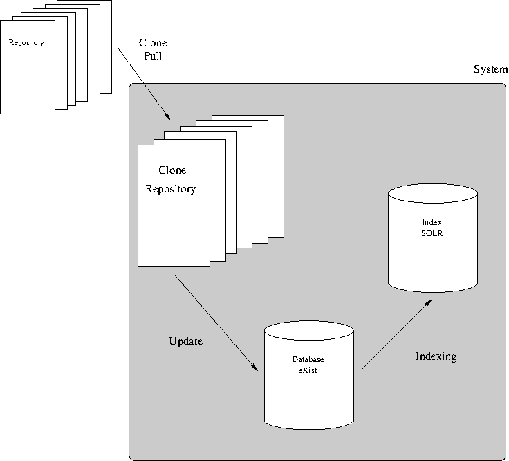

# Tools for the mirroring of repositories 

1. The term **repository** is used as a synonym for a data or software project stored in a revision control system. To begin with we limit ourselves to GIT.
2. The term **user** is referring to a library patron registrered in our user database. This **user** is an editor responsible for the **repository**
3. The term **system** is referring to the repository-mirror system
4. A **release** is a named version (a tag) which can be manipulated using git tag commands and in particular be retrieved in a predictable condition. A branch is dynamic and change until frozen and merged with its master branch.

## Workflow

### 0. One or more responsible library users register as a content providers

Done using [in our user database: AD/LDAP](#3-ldap-authentication-and-authorization)

### 1. An external repository is registered by the user who must also provide credentials for the remove git repository

We do not need this, unless the repository is private

### 2. The user selects a named release for to retrieve

The task should include a destination status

1. staging 
2. production

which determines which backend to address

### 3. The system queues the clone and pull operations

Getting data from the repository according to 2 above. Running asynchronously using [ActiveMQ](#4-activemq)

### 4. Upon successful cloning (3 above), the system queues loading and indexing of data

1. Store in database (eXist)
2. Ask for documents to index themselves
3. Store the index documents in index (Solr)

Some kind of pipeline implemented using [ActiveMQ](#4-activemq)

### 5. If failure in 3 above, messages should be passed to those who can do something about it

Task should be stored somewhere for re-execution

### 6. Upon successful loading in 4. above, the data become directly available in the environment selected in 2 above.

### 7. If failure, go to 5.

## Ideas

### 1. Git Large File Storage (LFS)

"Git Large File Storage (LFS) replaces large files such as audio
samples, videos, datasets, and graphics with text pointers inside Git,
while storing the file contents on a remote server like GitHub.com or
GitHub Enterprise" Sounds promising :^)

https://git-lfs.github.com/

Imagine correlated correlated or transcribed text and images, videos or sounds. A
system-dependent way of maintaining links and redirection of local
ones to a remote server.

### 2. Duplicating/mirroring repository

A true mirror (if we are not to push things to the origin, I believe). Not sure that helps

https://help.github.com/articles/duplicating-a-repository/

### 3. LDAP authentication and authorization

Should be easy to add an external contributor through Active Directory

https://httpd.apache.org/docs/2.4/mod/mod_authnz_ldap.html

That should relieve us from user management

### 4. activemq

http://activemq.apache.org/
